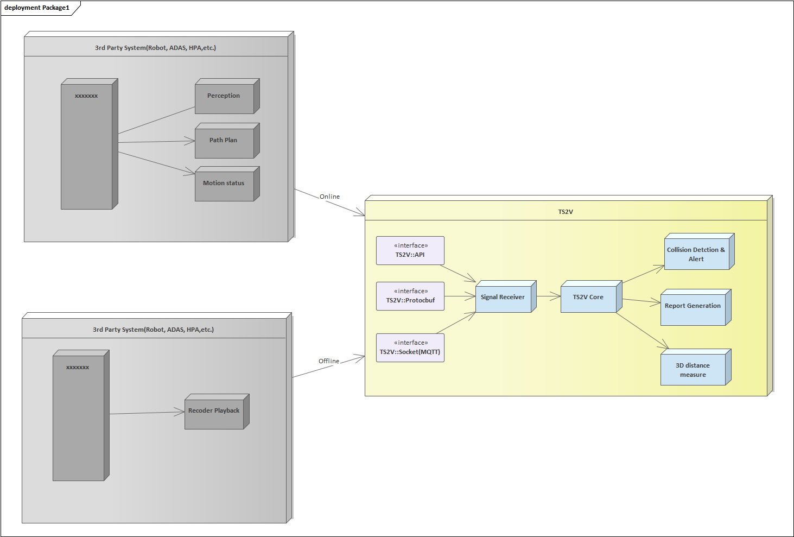

# Algorithm Verification & Scenario Visualization Kit (ASK)
## Background 
Gazebo is a popular ROS tool, which is used for simulation. It’s powerful to simulate some scenarios and even sensors (Camera, Lidar, etc.), however all the scenarios are from simulation not real env. It’s hard to cover all the corner cases. 

Rviz is another powerful ROS tool, which is used for visualization, not provide other special features(Concept Validation, Collision Verification, etc.). Meaning while, Pangolin provide almost same feature which is ROS-Free. 

 The project(ASK) aims to develop a ROS-free tool for SW solution validation and Algo reliable verification, which can be used in multi-domain, e.g. Robot, ADAS, APA, AVP, etc. 
       The project can't be used standalone, it need a front-end which injects signal to ASK.
## Demo with dummy signal

### 1. ADAS Scenario
    
### 2. Robot Scenario
  
### 2. Robot Demo

## Scopes
### 1.	Not provide simulator function, all the data & signal from real scenarios(On-line, Data/Signal playback, etc. )
### 2.	Not provide Algo solution, but help to verify Algo Accuracy & Precision with multi-method, e.g. Position Monitor, Collision Detection, Visualization and also support Report generation. The major features as the following. 

> ## 3D GUI
>- 3D Free View
>- Manipulate via keyboard & mouse
>- Activate or deactivate  Object manually(support, but not suggest)
>- Object filter
>- Support multi-coordinate  system(Global coordinate, Sensor based Local coordinate, DIN7K, UV, frenet, etc.)
>- visualize the following info, but not limit to 
>>1. Object type
>>1. Object info(Pos, Name, velocity, heading, etc.)
>>2. object contour
>>3. Historical trajectory for Ego & dynamic object
>>3. Path/Trajectory  plan for Ego
>>4. Ego motion state 
>>5. Etc.
> ## Algo Precision Assessment
>- Perception Precision assessment
>>> Note: The Ground truth(Labeled, Lidar, etc.) is necessary
>- Gloal/Local Path Plan Validation via Collision  Detection
>- Trajectory Plan Verification 
>- Motion (PID/MPC) Deviation Assessment 
>- Object Position drift monitoring after optimization (Filter/Post-process, etc.) 
>-  To be continue
> ## Report Generate
>- Report system status
>- Provide Report analyze tool/script 

## Deploy Diagram
 
 

## Flexibility: 
- ROS-Free
-	Cross OS(Linux, Android, Win)
>> Note: Mac & RTOS can support in theory, but need some more efforts, not plan yet.
- Provide static/dynamic/Bin format, easy to integrate into any project. 
- Most calculations are done within GPU(OpenGL), much efficient
- Support multi-sensor result.
- Support multi-Ground format, labeled, Lidar, etc.

## Interface with 3rd Party ECU or Component
- API
- Socket(Mqtt)
- protocbuf

## Dependency
  - OSG == 3.4.0
  - protocbuf == 2.0
  - spdlog & glog
  
## Compile & Running
> ## 1. Ubuntu
>> Install requirement  
>>> 1. protobuf(Optional): sudo apt-get install protobuf
>>> 1. glog(Optional): sudo apt-get install glog
>>> 2. a-style(Optional):sudo apt-get install astyle
>>> 3. OSG(Mandatory): sudo apt-get install opensencegraph

>> Compile:
>>> 1. Generate Protobuf file: make generate_protobuf_target
>>> 2. Compile lib & Demo: make -i8
>>> 3. coding style check: make astyle_check
> ## 2. Win && Android
>> TODO 

## License
  - Licensed under the GNU General Public License v3.0

## TODO
  - Vehicle motion mode(Ackermann, DifferentialDrive, etc.)
  - GUI Optimize
  - anti-aliasing 
  - new Object type support
  - add texture for 3D model
  - Report generation
  - etc.

## Contributes info
  - Author: Mo Bo
  - Mail: mobojingjiniao@126.com
  - Wechat:wxid_8626566265912
  - Contributors: xxx
    >Note: Plz contact me if interested with the project, any kinds of contributions and devotions are welcome, thanks.

----------
# Highlight   
## 1. The project just at the very beginning stage, let's make it perfect together, thanks.
## 2. Currently, not all the source code is disclosed. The enclosed codes are provided as static lib format. So that, any one can compile & run the code successfully. The remains codes are maintained in another repo, contact to get permission.